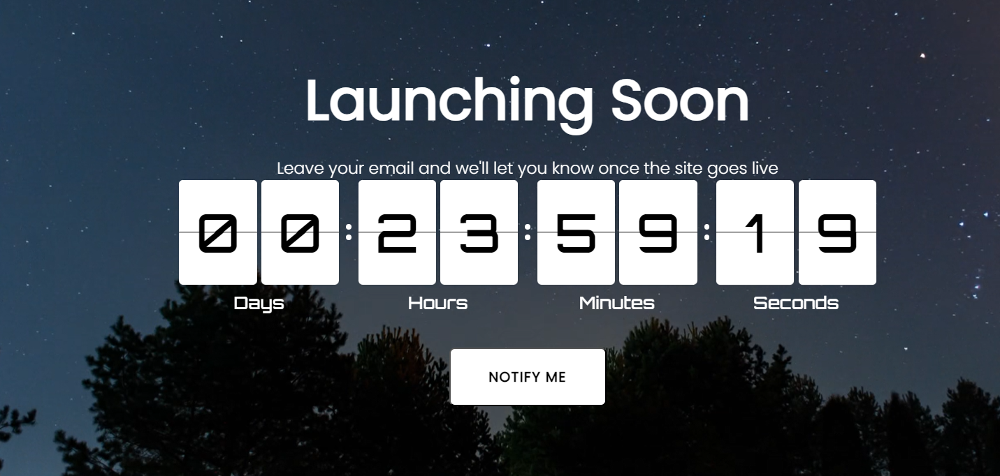

# Launch Countdown Webpage



This project is a simple and elegant launch countdown webpage with a background video. It features a countdown timer that counts down to a specific time, displayed with a flip clock animation, and includes a "Notify me" button for collecting emails.

## Features

- **Background Video**: Full-screen background video with infinite loop, autoplay, and muted settings.
- **Responsive Design**: Optimized for various screen sizes, with media queries to adjust styles on larger screens.
- **Flip Clock Countdown**: A visually appealing flip clock countdown timer using the `@leenguyen/react-flip-clock-countdown` package.
- **Overlay Effect**: Semi-transparent overlay on the video to improve text readability.
- **Notification Button**: A styled button for users to subscribe to notifications.

## Technologies Used

- **React**: Frontend library for building user interfaces.
- **CSS**: Styling of components and responsive design.
- **@leenguyen/react-flip-clock-countdown**: Package for flip clock countdown animation.
- **HTML5 Video**: Utilized for the background video with custom styling.

## Setup and Installation

1. Clone the repository:
   ```bash
   git clone https://github.com/yourusername/launch-countdown-webpage.git
